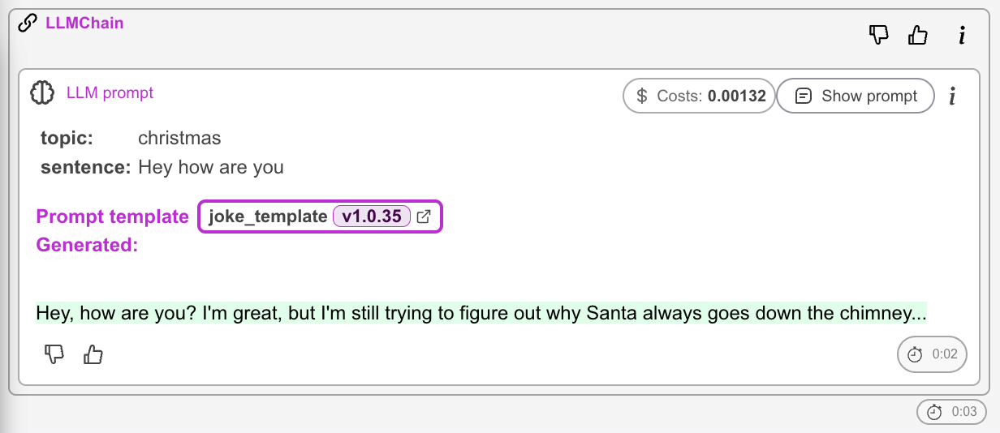

# Prompt templates versioning

#### Keep Track of Your Prompt Template Changes

Making changes to your prompt templates can be a delicate process, and it's not always easy to know what impact those changes will have on your system. Version control platforms like GIT are great for tracking code changes, but they're not always the best solution for tracking prompt changes.

With PromptWatch you can register your prompts and track all their executions based on the prompt version automatically. This makes it easy to keep tabs on any changes you make to your prompts and quickly compare the overall performance of specific versions


## How to register a template

You just need to wrap your **🦜🔗LangChain** `PromptTemplate` object with `register_prompt_template` method. This method will return the same instance of  `PromptTemplate` but it will add some metadata to it so we can identify it during session. 

You need to name your template and you can also assign a version number. Version number is meant for tracking a major version changes (after some more serious modification). 

```python
from promptwatch import register_prompt_template
from langchain import OpenAI, LLMChain, PromptTemplate

prompt_template = PromptTemplate.from_template("Finish this sentence {input}")
prompt_template = register_prompt_template("name_of_your_template",prompt_template)
my_chain = LLMChain(llm=OpenAI(), prompt=prompt_template)

with PromptWatch() as pw:
    my_chain("The quick brown fox jumped over")

```

### Recommendations for versioning
- PromptWatch work the best with version number in [SemVer](https://semver.org/) format (i.e. 1.0.0)
- Ideally you should only assign only first two number: `1.0` and PromptWatch will automatically track the *PATCH* version (by comparing the prompt template hash). It will auto-increment the last number (*PATCH*) of the version on every change. (If you revert the changes, it will assign previous version number).
- If you assign version in any other format then `{MAJOR}.{MINOR}` , in case of a conflict (the version in the registration code hasn't changed, but the content of the template did), it will assign `-rev{n}` suffix (rev = *revision*).


## Execution tracking

Once properly set up, PromptWatch will automatically track each execution of the template (given that is has been run in the `PromptWatch` context).
You will be able to see the version used in the session details:



and you will be also able to see all the versions and their executions in *Prompt* section of the app:
